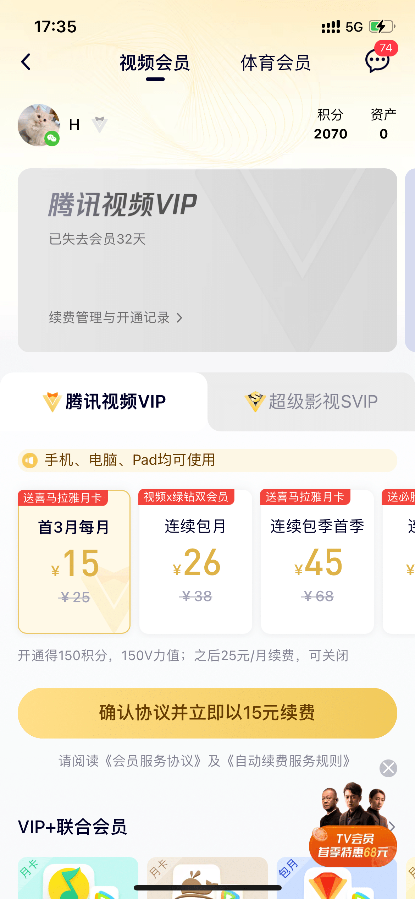
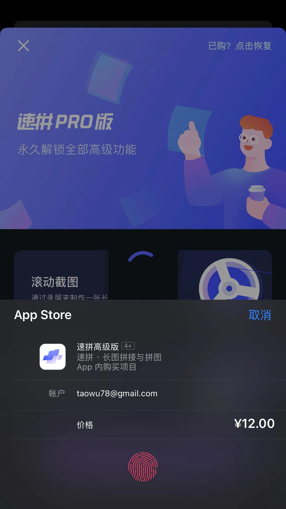
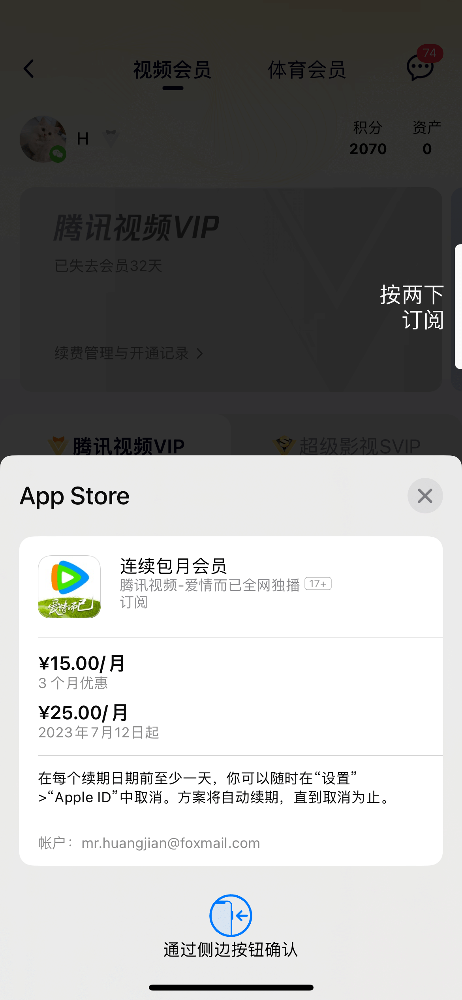
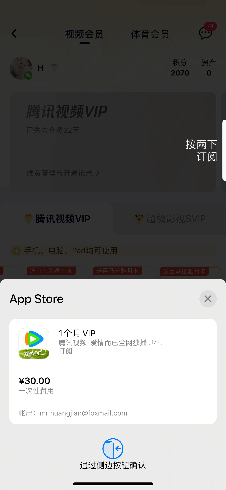

# 商品

一个商品包含的信息（举例）
- 商品类型（消耗型内购）
- 销售范围（中国大陆）
- 商品标识（com.gf.palacem5cncn.hwyios.app2.648lb）
- 商品名称（648元礼包）
- 商品描述（购买此商品后可以获得6480灵玉）
- 商品定价（648）
- 显示金额（¥648.00）
- 国家代码（CN）
- 货币代码（CNY）
- 货币符号（¥）

问题
- 商品类型、销售范围等，是否可以变更？
- 商品名称、商品描述等，是否可以多语言配置？

# 商品类型

商品类型一旦确定后，将无法更改！

## 消耗型内购（多次累加）

可以购买多次，多次结果累加，并且在 App 内作为“货币”消耗。
典型的是虚拟货币，用户先通过购买虚拟货币，再消耗虚拟货币购买商品。

## 非消耗型内购（一次买断）

同一个 Apple ID 只能购买一次，可跨设备使用，业务场景较少。
典型的是图书 App 中的一本电子书，或者游戏中的一个关卡。

## 自动续期订阅

和时间相关的服务，在有效期内用户可享受服务，到期后自动扣费，退订需要到 Apple ID 的管理后台操作。
典型的是连续包月的会员，自动续期订阅还可以加优惠活动。

## 非续期订阅

和时间相关的服务，但是不会自动扣费，比如一个月VIP会员。
有些做活动，自动订阅的VIP会员，每月的价格会比非续期订阅的VIP会员价格更低。

# 商品标识

任一商品的商品标识，在全网所有苹果应用中唯一。
如果将该商品删除，该商品的商品标识也不能再次使用！

---

- 档位申请
- 商品类型
- 显示价格
- 实际支付价格
- 国际化汇率
