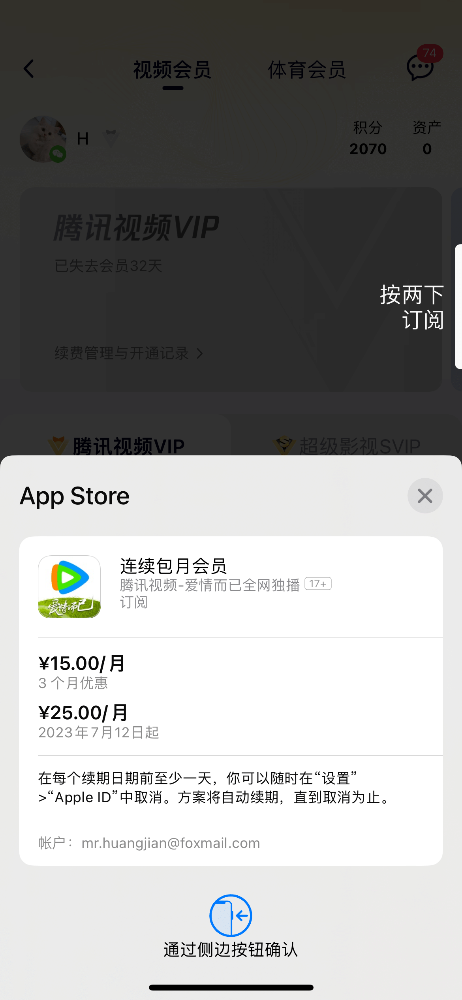

# 通用内购流程

举例说明：
你在东吴面馆点了**一份鸡汁大排面**，
然后店员让你出示二维码，
然后你扫码**付款**，
然后店员将**小票**交给你，
然后你坐等店员**把面端给你**，
然后你尽情享受美食。

1. 选择商品及数量
    选择商品：在应用界面选择商品，比如订阅商品或一次性商品。
    选择数量：绝大部分都是1份。
    

2. 是否允许购买
    ```swift
    // NO if this device is not able or allowed to make payments
    // @available(iOS 3.0, *)
    // open class func canMakePayments() -> Bool
    SKPaymentQueue.canMakePayments()
    ```
    [苹果官网：防止从 App Store 进行 App 内购买](https://support.apple.com/zh-cn/HT204396) 
    其中一种情况是：如果“设置>屏幕使用时间>内容和隐私访问限制>iTunes Store与App Store购买项目>App内购买项目=不允许”，则完全不允许购买。

3. 前台付钱扣款
    如果 Apple ID 未登录，则先弹窗登录。
    

    - 如果已付钱但未交付(丢单)，则需要补单。如何进行补单？
    - 如果因为银行卡余额不足导致扣款失败会怎么样？
    - 如果订单回调失败应该怎么处理？

4. 生成订单及票据

5. 后台发货交付

6. 关闭订单
    - 什么时候关单(结单)？
    - 如果不关闭订单会怎样？将无法继续内购
